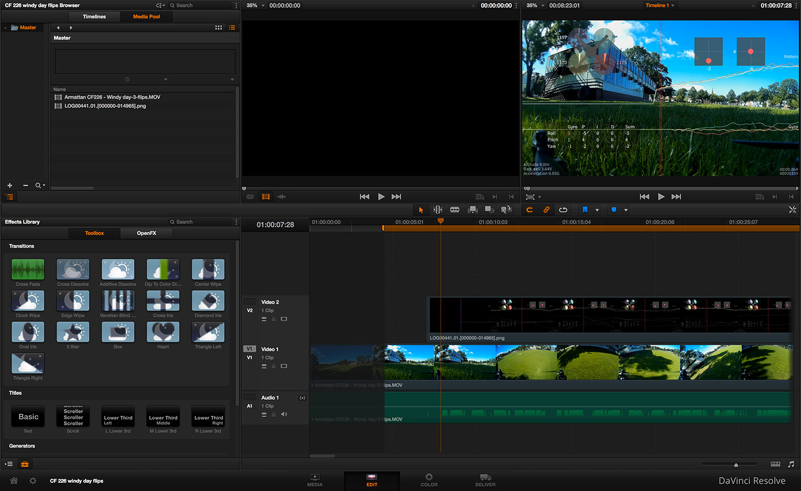

# Blackbox flight data recorder tools


## Introduction

These tools allow you to convert flight data logs recorded by Cleanflight's Blackbox feature into CSV files
(comma-separated values) for analysis, or into a series of PNG files which you could turn into a video.

You can download the latest executable versions of these tools for Mac or Windows from the "releases" tab above. If
you're running Linux, you must build the tools from source (instructions are further down this page).

## Using the blackbox_decode tool

This tool converts a flight log binary ".TXT" file into CSV format. Typical usage (from the command line) would be like:

```bash
blackbox_decode LOG00001.TXT
```

That'll decode the log to `LOG00001.01.csv` and print out some statistics about the log. If you're using Windows, you
can drag and drop your log files onto `blackbox_decode` and they'll all be decoded. Please note that you shouldn't
discard the original ".TXT" file, because it is required as input for other tools like the PNG image renderer.

If your log file contains GPS data then a ".gpx" file will also be produced. This file can be opened in Google Earth
or some other GPS mapping software for analysis. This feature is experimental.

Use the `--help` option to show more details:

```text
Blackbox flight log decoder by Nicholas Sherlock

Usage:
     blackbox_decode [options] <input logs>

Options:
   --help                   This page
   --index <num>            Choose the log from the file that should be decoded (or omit to decode all)
   --limits                 Print the limits and range of each field
   --stdout                 Write log to stdout instead of to a file
   --unit-amperage <unit>   Current meter unit (raw|mA|A), default is A (amps)
   --unit-frame-time <unit> Frame timestamp unit (us|s), default is us (microseconds)
   --unit-height <unit>     Height unit (m|cm|ft), default is cm (centimeters)
   --unit-rotation <unit>   Rate of rotation unit (raw|deg/s|rad/s), default is raw
   --unit-acceleration <u>  Acceleration unit (raw|g|m/s2), default is raw
   --unit-gps-speed <unit>  GPS speed unit (mps|kph|mph), default is mps (meters per second)
   --unit-vbat <unit>       Vbat unit (raw|mV|V), default is V (volts)
   --merge-gps              Merge GPS data into the main CSV log file instead of writing it separately
   --simulate-current-meter Simulate a virtual current meter using throttle data
   --sim-current-meter-scale   Override the FC's settings for the current meter simulation
   --sim-current-meter-offset  Override the FC's settings for the current meter simulation
   --simulate-imu           Compute tilt/roll/heading fields from gyro/accel/mag data
   --imu-ignore-mag         Ignore magnetometer data when computing heading
   --declination <val>      Set magnetic declination in degrees.minutes format (e.g. -12.58 for New York)
   --declination-dec <val>  Set magnetic declination in decimal degrees (e.g. -12.97 for New York)
   --debug                  Show extra debugging information
   --raw                    Don't apply predictions to fields (show raw field deltas)
```

## Using the blackbox_render tool

This tool converts a flight log binary ".TXT" file into a series of transparent PNG images that you could overlay onto
your flight video using a video editor (like [DaVinci Resolve][] ). Typical usage (from the command line) would be like:

```bash
blackbox_render LOG00001.TXT
```

This will create PNG files at 30 fps into a new directory called `LOG00001.01` next to the log file.

Use the `--help` option to show more details:

```text
Blackbox flight log renderer by Nicholas Sherlock

Usage:
     blackbox_render [options] <logfilename.txt>

Options:
   --help                 This page
   --index <num>          Choose which log from the file should be rendered
   --width <px>           Choose the width of the image (default 1920)
   --height <px>          Choose the height of the image (default 1080)
   --fps                  FPS of the resulting video (default 30)
   --prefix <filename>    Set the prefix of the output frame filenames
   --start <x:xx>         Begin the log at this time offset (default 0:00)
   --end <x:xx>           End the log at this time offset
   --[no-]draw-pid-table  Show table with PIDs and gyros (default on)
   --[no-]draw-craft      Show craft drawing (default on)
   --[no-]draw-sticks     Show RC command sticks (default on)
   --[no-]draw-time       Show frame number and time in bottom right (default on)
   --[no-]plot-motor      Draw motors on the upper graph (default on)
   --[no-]plot-pid        Draw PIDs on the lower graph (default off)
   --[no-]plot-gyro       Draw gyroscopes on the lower graph (default on)
   --smoothing-pid <n>    Smoothing window for the PIDs (default 4)
   --smoothing-gyro <n>   Smoothing window for the gyroscopes (default 2)
   --smoothing-motor <n>  Smoothing window for the motors (default 2)
   --prop-style <name>    Style of propeller display (pie/blades, default pie)
   --gapless              Fill in gaps in the log with straight lines
```

(At least on Windows) if you just want to render a log file using the defaults, you can drag and drop a log onto the
blackbox_render program and it'll start generating the PNGs immediately.

[DaVinci Resolve]: https://www.blackmagicdesign.com/products/davinciresolve

### Assembling video with DaVinci Resolve



[DaVinci Resolve][] is one free option for turning your PNGs into a video that is synced with your flight video.

In Resolve, create a new project. On the Media tab, find your flight video and drag it from the top pane to the bottom
one to add it to your media library. When prompted, choose the option to change your framerate/resolution settings to
match the video you added. Now add the PNG series that you rendered with `blackbox_render` (it'll be represented as a
single file). If the PNGs don't appear in the media library, try right clicking on the folder that contains them and 
selecting "Refresh".

Now over on the Edit tab, click File -> New Timeline and click Ok. At the top left, switch over to the Media Pool. Drag
and drop your flight video onto the timeline, then drag and drop the Blackbox stream onto the video track above it.
You'll need to play around with the alignment between the two tracks to sync things up (I usually sync up the audio from
the initial throttle-up with the throttle-up shown on the motor graph). 

If your Blackbox PNGs were rendered using the default settings (30 FPS) and your flight video is 60 FPS, you'll need to
right-click on the Blackbox stream and click "change clip speed". Enter 30 FPS since this is the FPS that you rendered
the Blackbox PNGs at.

Save your viewers' ears by dragging the midpoint of the audio track downwards to reduce its volume, or replace the
audio with your own music track!

Now on the Deliver tab, choose something like the "video sharing export" Easy Setup preset. On the left pane, choose an
output folder for the "render to:" setting. Then click the "add job to render queue" button on the left. Now click the
"start render" button on the right to begin rendering the output.

## Building tools
If you just want to download some prebuilt versions of these tools, head to the "releases" tab on the GitHub
page. However, if you want to build your own binaries, or you're on Linux where we haven't provided binaries, please
read on.

The `blackbox_decode` tool for turning binary flight logs into CSV doesn't depend on any libraries, so can be built by
running `make obj/blackbox_decode`. You can add the resulting `obj/blackbox_decode` program to your system path to
make it easier to run.

The `blackbox_render` tool renders a binary flight log into a series of PNG images which you can overlay on your flight
video. Please read the section below that most closely matches your operating system for instructions on getting the `libcairo`
library required to build the `blackbox_render` tool.

#### Ubuntu
You can get the tools required for building by entering these commands into the terminal:

```bash
sudo apt-get update
sudo apt-get install make gcc libcairo2-dev
```

Build blackbox_render by running `make obj/blackbox_render` (or build both tools by just running `make`).

#### MacOSX
The easiest way to build is to install the [Xcode development tool][], then install an environment like [Homebrew][] 
or [MacPorts][] onto your system.

From MacPorts, you would do this to get LibCairo:

```bash
sudo port selfupdate
sudo port install cairo
```

Afterwards you can run `make` to build blackbox_render.

If you are using Homebrew instead of MacPorts, run:

```bash
brew install cairo --without-x11 pkg-config
```

Afterwards you can run `make` to build blackbox_render.

If you get an error "Package 'xcb-shm', required by 'cairo', not found", your installed version of Cairo depends on
X11 but your Homebrew X11 libraries are not on your pkgconfig path, so the build process cannot find them. Try this to
add them to your path:

```bash
$ export PKG_CONFIG_PATH=/usr/local/lib/pkgconfig:/opt/X11/lib/pkgconfig
```

[Xcode development tool]: https://itunes.apple.com/us/app/xcode/id497799835
[Homebrew]: http://brew.sh/
[MacPorts]: https://www.macports.org/

#### Windows
The tools can be built with Visual Studio Express 2013, just open up the solution in the `visual-studio/`
folder. You'll need to include the .DLL files from `lib/win32` in the same directory as your built
executable.

## License

This project is licensed under GPLv3.

The binary version of `blackbox_render` for MacOSX is statically linked to these libraries:

 - libbz2 http://www.bzip.org/ (BSD-like)
 - zlib http://www.zlib.net/
 - libcairo & libpixman http://cairographics.org/ (LGPL)
 - libfreetype http://www.freetype.org/ (BSD-like/GPLv2)
 - libpng16 http://www.libpng.org/pub/png/libpng.html
 
The windows binary of `blackbox_render` additionally ships with these DLLs:

 - libiconv https://www.gnu.org/software/libiconv/ (LGPL)
 - libfontconfig http://www.freedesktop.org/wiki/Software/fontconfig/
 - libxml2 http://xmlsoft.org/ (MIT)
 - liblzma http://tukaani.org/xz/ (Public Domain)
 
This font is included with both binary and source distributions:

 - Source Sans Pro - Regular https://github.com/adobe-fonts/source-sans-pro (SIL Open Font license)
 
Both binary and source builds include IMU code from Baseflight https://github.com/multiwii/baseflight (GPLv3)